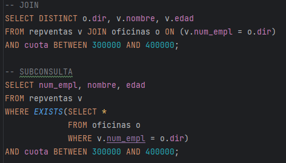

### COUNT -> MAX -> COUNT
```sql

/*5. 	Mostra el id i el número d'empleats del departament que té més empleats.*/
select e1.department_id, count(e1.employee_id)
from employees e1
group by e1.department_id
having count(e1.employee_id)
          =(select max(c) from (select count(e2.employee_id)
              as c from employees e2 group by e2.department_id) as a);
```

